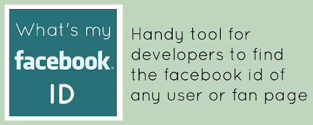

ChromeExtension-Whats-my-Facebook-ID
================================
Chrome extension to find the facebook id of any facebook user or fan page.

Installation
================================
You can load the extension from Chrome's Extension tab under settings using *Load unpacked extension...* option once you have enabled Developer mode. Select the **findfacebookid** folder while installing the extension.
